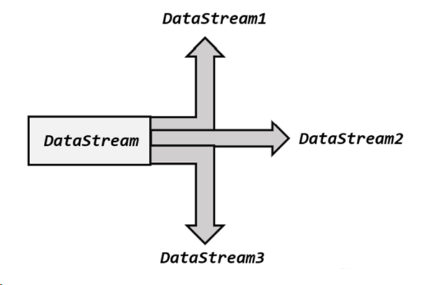

# 核心概念(笔记)

Flink中，数据分为两种，一种批式(Batch)数据，我们成为数据集(DataSet),一种流式(Stream)数据，称为数据流(DataStream)

对应的数据计算操作就是批处理和流处理，在FLink中可以使用DataSet Api 和 DataStream Api进行处理

Alink基于Flink，故两者通吃

Alink类似Flink，对数据的操作流程也范围三步数据源（Source）、算法组件（Operator）和数据导出（Sink）


Alink底层通过Flink Table作为流个批的数据表示，这其实可以通过MemSourceBatchOp的参数看出,理论上可以相互转换，还没试过，后面玩玩


## 流批

先不考虑Flink中批其实是一种特殊的流

### 批

和FLink一样 不多赘述

批处理，就是将数据当做一个整体，通常用于应对有界数据

以下是批处理任务的DAG


在批处理流程中，每个组件都依赖上一个组件，即，要等待下一个组件完成后，自己才能开工


### 流

流处理类似流水线，他不管数据什么时候会结束，来一条我就处理一条，有点像流水线

以下是流处理任务的DAG


流处理无需等待上一组件完成，来一条就做一条(这也是与Spark的微批不同的地方)

### 流批混跑

Alink支持流批混跑，以下是流批混跑的DAG


当出现流批混跑的情况时，Alink会`先做批理批`，并将批处理的结果作为流处理的一个初始数据，然后进行流处理

##　Alink = A + Link

有点类似FLink算子的概念，Alink中对数据的操作都发生在组件中；

> Alink定义了组件的抽象基类AlgoOperator，规范了组件的基本行为。由AlgoOperator派生出了两个基类：用于批式计算及处理场景的批式算法组件（BatchOperator）和用于流式计算及处理场景的流式算法组件（StreamOperator）。

所以A就是基类AlgoOperator

无论是BatchOperator还是StreamOperator，他们都支持linkxxx()方法,这些方法可以将组件的工作流程串联，这就是官方对A + Link的解释


### Operator

> 由算法组件的抽象基类（AlgoOperator）派生出两个基类：批式算法组件（BatchOperator，或称为批式处理组件、批式组件）和流式算法组件（StreamOperator，或称为流式处理组件、流式组件）

以下是它们的UML类图：


其实也能看出，Alink的数据其实底层用的就是Flink Table Api，而且无论是BatchOperator还是StreamOperator，他们都支持linkxxx()方法。

在WithParam里面提供了设置以及读取参数的接口，并在AlgoOperator中实现，还定义了Table类型的变量table，以及Table类型数组的变量sideTables，用来存放算法的结果，并提供方法供后续组件读取。

BatchOperator和StreamOperator中，linkxxx()方法的参数数不一样的，这也就限制了批只能和批连，流只能和流连。那它流批混跑怎么实现的，管道？

> 通过这样的定义，批式任务和流式任务都可以用相同的方式进行描述，这样就可以大大降低批式任务和流式任务转换的代价。若需要将一个批式任务改写为流式任务，只需要将批式组件后面的“BatchOp”后缀变为“StreamOp”，相应的link操作便可转换为针对流式数据的操作。也正是因为Alink的批式组件和流式组件有如此密切的联系，所以才能将机器学习的管道（Pipeline）操作推广到流式场景。

为什么在AlgoOperator定义了table，还要定义个Table[]类型的sideTable,说人话就是不够用,官方解释:

> 算法的输入数据，在大多数情况下可以用一个表（Table）表示，但也有不少情况下需要用多个表（Table）才能表示。比如Graph数据，一般包括Edge Table和Node Table，这两个表在一起才是完整的表示。算法的输出也是这样的情况。在大多数情况下可以用一个表（Table）表示，但也有不少情况下需要用多个表（Table）才能表示。比如，Graph操作的结果还是Graph，仍然需要用2个Table分别表示结果图中各条边和各个顶点的信息。自然语言方面的常用算法LDA（Latent Dirichlet Allocation）的计算结果为6个Table。其算法组件包含了一个Table类型的成员变量table，用来放置该组件的主输出结果（大多数情况下，算法计算的结果只有一个Table，输出到该变量即可）。该算法组件也定义了一个Table类型数组的变量sideTables，该变量用来存储在多表（Table）输出的情况下，除主表外的所有其他表。

### Link

Link就是将各个主键之间进行窗帘，将多个简单的操作串联成一个复杂的操作，从而去描述各种奇奇怪怪的操作

#### link的使用

> 一对一
>
> - A.linkTo(B)
> - B.linkFrom(A)
> - A.link(B)
>
> 这里，可将link看作linkTo的简写。
>
> 关于两个组件A、B之间的连接（link）关系，很容易理解。在实际应用中，我们还会遇到更复杂的情况，但使用link方法仍可以轻松处理。
>
> 
>
> 一对多的
>
> 组件B1、B2、B3均需要组件A的计算结果，组件间的关系可以通过以下多种方式表示：
>
> - A.linkTo(B1)，A.linkTo(B2)，A.linkTo(B3)
> - A.link(B1)，A.link(B2)，A.link(B3)
> - B1.linkFrom(A)，B2.linkFrom(A)，B3.linkFrom(A)
> - A.linkTo(B1)，A.link(B2)，B3.linkFrom(A)
>
> 从上述表示方式上可以看出，表示方式可以很灵活。因为组件B1、B2、B3与组件A的关系是独立的，所以可以分别选用表示方式。
>
> 
>
> 多对一
>
> 组件B同时需要组件A1、A2、A3的计算结果，表示方式只有一种：
>
> ```plain
> B.linkFrom(A1, A2, A3)
> ```
>
> 即，linkFrom可以同时接入多个组件。

#### Link有方向

link和linkTo都是左前右后，而LinkForm相反，是左后右前

批式处理组件BatchOperator的相关代码如下：

```java
public abstract class BatchOperator {
   ... ...
public BatchOperator link(BatchOperator f) {
    return linkTo(f);
}

public BatchOperator linkTo(BatchOperator f) {
    f.linkFrom(this);
    return f;
}

abstract public BatchOperator linkFrom(BatchOperator in);

public BatchOperator linkFrom(List<BatchOperator> ins) {
    if (null != ins && ins.size() == 1) {
        return linkFrom(ins.get(0));
    } else {
        throw new RuntimeException("Not support more than 1 inputs!");
    }
}
   ... ...
}
```

流式处理组件StreamOperator的相关代码如下：

```java
public abstract class StreamOperator {
   ... ...
public StreamOperator link(StreamOperator f) {
    return linkTo(f);
}

public StreamOperator linkTo(StreamOperator f) {
    f.linkFrom(this);
    return f;
}

abstract public StreamOperator linkFrom(StreamOperator in);

public StreamOperator linkFrom(List <StreamOperator> ins) {
    if (null != ins && ins.size() == 1) {
        return linkFrom(ins.get(0));
    } else {
        throw new RuntimeException("Not support more than 1 inputs!");
    }
}
   ... ...
}
```

可以看出，link单纯只是linkTo的一个简写，而LinkTo，最终还是调用了LinkFrom，且a.linkTo(b) = b.linkFrom(a)

#### link的使用

每个Operate都有linkxxx()方法，简单试试

```java
ata
	.link(  //选择几个字段
		new SelectBatchOp("sepal_length, sepal_width, category")
	).link( //只要山鸢尾
		new FilterBatchOp("category='Iris-setosa'")
	).link( //留前5行
		new FirstNBatchOp().setSize(5)
	).print();
```

#### link的简化

一直写link也显得很繁琐，为此Alink对常见的操作定义了一些方法，具体IDEA点一下就出来了，例如将上一段简写：

```java
data
	.select("sepal_length, sepal_width, category")
	.filter("category='Iris-setosa'")
	.firstN(5)
	.print();
```

#### 侧输出和linkFrom

侧输出，看来和Flink一样,一个操作可以有多个输出



对于多输出，可以使用linkForm将其聚在一起

## Pipeline与PipelineModel

管道最早来自[scikit-learn](http://scikit-learn.org/stable/),管道的概念和SparkML一样，可将多个操作连接，数据统一通过管道，这就保证了数据的一致性。

管道是为了批式训练模型而准备的，但训练出的模型也可用于流式预测，

> 管道分为若干个阶段（PipelineStage），数据每通过一个阶段就发生一次变换，数据通过整个管道，也就依次经历了所有变换。

> 如果要在管道中加入分类器，对数据进行类别预测，就涉及模型的训练和预测，这需要分两个步骤完成。所以，管道也会被细分为管道定义与管道模型（PipelineModel）。在管道定义中，每个PipelineStage会按其是否需要进行模型训练，分为估计器（Estimator）和转换器（Transformer）。随后，可以对其涉及模型的部分，即对估计器（Estimator）进行估计，从而得到含有模型的转换器。该转换器被称为Model，并用Model替换相应的估计器，从而每个阶段都可以直接对数据进行处理。我们将该Model称为PipelineModel。
>
> 
>
> - 转换器（Transformer）：Pipeline中的处理模块，用于处理Table。输入的是待处理的数据，输出的是处理结果数据。比如，向量归一化是一个常用的数据预处理操作。它就是一个转换器，输入向量数据，输出的数据仍为向量，但是其范数为1。
> - Model：派生于转换器（Transformer）。其可以存放计算出来的模型，用来进行模型预测。其输入的是预测所需的特征数据，输出的是预测结果数据。
> - 估计器（Estimator）：估计器是对输入数据进行拟合或训练的模型计算模块，输出适合当前数据的转换器，即模型。输入的是训练数据，输出的是Model。

从Pipeline到PipelineModel一共分为三个阶段

* 定义过程：这时候会将各个操作依次丢进管道，组成管道的执行流程
* 训练过程：使用fit方法对Pipeline进行训练，生成PipelineModel，此时原Pipeline还没消失，你依旧可以通过对其传入不一样的训练数据，得到另一个PipelineModel
  * 
* 数据处理过程：使用训练出的PipelineModel对数据进行转换


（慢慢学，还没写完）

